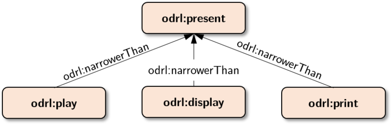

# rusadrl
This is rust implementation of ODRL 2.2 by following the specification at
https://www.w3.org/TR/odrl-model/

### Validation reference
- https://www.w3.org/2016/poe/wiki/Validation

### Policy Inference



#### IncludedIn
```xml
odrl:play odrl:includedIn odrl:present . 
odrl:display odrl:includedIn odrl:present . 
odrl:print odrl:includedIn odrl:present .
```
```xml
<http://example.com/policy:01a>
    a odrl:Policy;
    odrl:permission [
        a odrl:Permission ;
        odrl:target ex:PartA ;
        odrl:action odrl:present ;
        odrl:assignee ex:Bob
    ] ;
    odrl:prohibition [
        a odrl:Prohibition ;
        odrl:target ex:PartB ;
        odrl:action odrl:print ;
        odrl:assignee ex:Bob
    ] .
```
Inferred
```xml
<http://example.com/policy:01b>
    a odrl:Policy;
    odrl:permission [
        a odrl:Permission ;
        odrl:target ex:PartA ;
        odrl:action odrl:present ;
        odrl:action odrl:play ; 
        odrl:action odrl:display; 
        odrl:action odrl:print ; 
        odrl:assignee ex:Bob
    ] ;
    odrl:prohibition [
        a odrl:Prohibition ;
        odrl:target ex:PartB ;
        odrl:action odrl:print ;
        odrl:assignee ex:Bob
    ] .
```

#### Semantics of Party Relations

```xml
ex:Bob odrl:partOf ex:W3C . 
ex:Alice odrl:partOf ex:W3C .
```
Raw
```xml
<http://example.com/policy:02a>
    a odrl:Policy;
    odrl:permission [
        a odrl:Permission ;
        odrl:target ex:PartA ;
        odrl:action odrl:play;
        odrl:assignee ex:W3C
    ] .
```
Inferred
```xml
<http://example.com/policy:02b>
    a odrl:Policy;
    odrl:permission [
        a odrl:Permission ;
        odrl:target ex:PartA ;
        odrl:action odrl:play;
        odrl:assignee ex:W3C ;
	    odrl:assignee ex:Alice ;
	    odrl:assignee ex:Bob 
    ] .
```

### Semantics of Asset Relations

```xml
ex:PartA odrl:partOf ex:Dataset1 . 
ex:PartB odrl:partOf ex:Dataset1 .
```

Raw
```xml
<http://example.com/policy:03a>
    a odrl:Policy;
    odrl:permission [
        a odrl:Permission ;
        odrl:target ex:Dataset1 ;
        odrl:action odrl:play ;
        odrl:assignee ex:Alice
    ] .
```
Inferred
```xml
<http://example.com/policy:03b>
    a odrl:Policy;
    odrl:permission [
        a odrl:Permission ;
        odrl:target ex:Dataset1 ;
        odrl:target ex:PartA ;
        odrl:target ex:PartB ;
        odrl:action odrl:play ;
        odrl:assignee ex:Alice
    ] .
```
#### Inferences derived from odrl:implies
```xml
odrl:share odrl:implies odrl:distribute . 
odrl:move odrl:implies odrl:delete . 

<http://odrlapi.appspot.com/samples/sample079>
    a odrl:Policy;
    odrl:permission [
        a odrl:Permission ;
        odrl:target ex:PartA ;
        odrl:action odrl:share ;
        odrl:assignee ex:Bob
    ] ;
    odrl:prohibition [
        a odrl:Prohibition ;
        odrl:target ex:PartB ;
        odrl:action odrl:move ;
        odrl:assignee ex:Bob
    ] .
```

Inferred

```xml
<http://odrlapi.appspot.com/samples/sample079>
    a odrl:Policy;
    odrl:permission [
        a odrl:Permission ;
        odrl:target ex:PartA ;
        odrl:action odrl:share ;
        odrl:action odrl:distribute ; 
        odrl:assignee ex:Bob
    ] ;
    odrl:prohibition [
        a odrl:Prohibition ;
        odrl:target ex:PartB ;
        odrl:action odrl:move ;
        odrl:assignee ex:Bob
    ] .
```

#### Interiorizing policy-level properties
```xml
<http://odrlapi.appspot.com/samples/sample001x>
    odrl:target <http://odrlapi.appspot.com/samples/asset000> ;
    odrl:permission [
        odrl:action odrl:reproduce
    ];
    odrl:prohibition[
        odrl:action odrl:print
    ] .
```

expanded
```xml
<http://odrlapi.appspot.com/samples/sample001x>
    odrl:permission [
        odrl:action odrl:reproduce ;
        odrl:target <http://odrlapi.appspot.com/samples/asset000> 
    ];
    odrl:prohibition[
        odrl:action odrl:print ;
        odrl:target <http://odrlapi.appspot.com/samples/asset000> 
    ] .
```

#### Application of inheritance rules
```xml
<http://odrlapi.appspot.com/samples/sample045>
    odrl:assigner <http://example.com/org-01> ;
    odrl:obligation [
        odrl:target <http://example.com/asset:terms-and-conditions> ;
        odrl:action odrl:reviewPolicy
    ] .
<http://odrlapi.appspot.com/samples/sample045b>
    a odrl:Agreement ;
    odrl:inheritFrom <http://odrlapi.appspot.com/samples/sample045> ;
    odrl:assignee <http://example.com/user:0001> ;
    odrl:permission [
        odrl:target <http://example.com/asset:555> ;
        odrl:action odrl:display
    ] .
```

Expanded

```xml
<http://odrlapi.appspot.com/samples/sample045>
    odrl:assigner <http://example.com/org-01> ;
    odrl:obligation [
        odrl:target <http://example.com/asset:terms-and-conditions> ;
        odrl:action odrl:reviewPolicy
    ] .
<http://odrlapi.appspot.com/samples/sample045b>
    a odrl:Agreement ;
    odrl:assignee <http://example.com/user:0001> ;
    odrl:permission [
        odrl:target <http://example.com/asset:555> ;
        odrl:action odrl:display
    ]  ;
    odrl:assigner <http://example.com/org-01> ;
    odrl:obligation [
        odrl:target <http://example.com/asset:terms-and-conditions> ;
        odrl:action odrl:reviewPolicy
    ] .
```